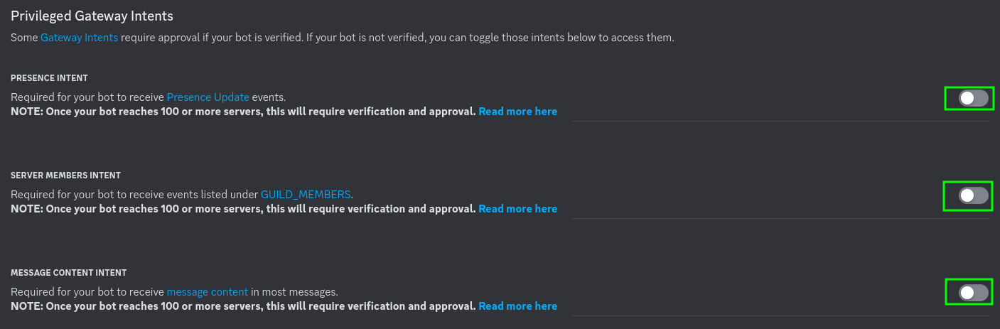
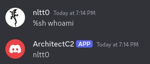
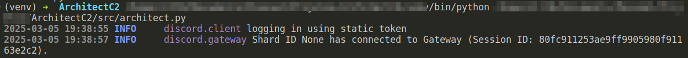

# Install

0 - Generate bot_token in [here](https://www.writebots.com/discord-bot-token/)
1 - Active Bot Options
    * Privileged Gateway Intents
        - Presence Intent
        - Server Members Intent
        - Message Content Intent
    

2 - Add bot_token in _bot.run('TOKEN')_

3.1 - Generate code in client windows
```
Download ArchitectC2.zip and unzip
cd ArchitectC2
curl https://bootstrap.pypa.io/get-pip.py -o get-pip.py
python get-pip.py
python -m pip -r install requirements.txt
pyinstaller --onefile --name=Architect architect.py
.\ArchitectC2
```

3.2 - Generate code in client linux
```
Download ArchitectC2.zip and unzip
cd ArchitectC2
pip -r install requirements.txt
pyinstaller --onefile --name=Architect architect.py
./Architect
```


# Usage

%sh *command*




# After execute

